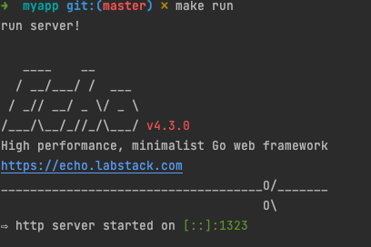
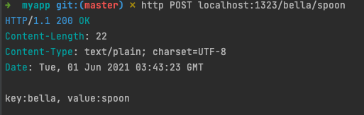
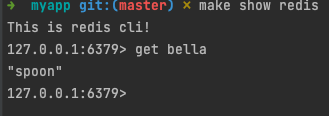

# Echo Framework Redis 연동

## Redis Installation
  - https://github.com/go-redis/redis
  - Redis port : 6379 
  - ```bash
    $ go mod init github.com/my/repo
    $ go get github.com/go-redis/redis/v8
    ```
## Client
```go
func Client(key string, value string) {
	rdb := redis.NewClient(&redis.Options{
		Addr:     "localhost:6379",
		Password: "", // no password set
		DB:       0,  // use default DB
	})

	err := rdb.Set(ctx, key, value, 0).Err()
	if err != nil {
		panic(err)
	}

	val, err := rdb.Get(ctx, key).Result()
	if err != nil {
		panic(err)
	}
	fmt.Println(key, val)

}
```
## API

- path 로 전달되는 파라미터를 획득 (https://lejewk.github.io/go-echo-request-param/)
- 넘겨준 파라미터 (key, value)를 작성한 `ExampleClient`로 넘김
```go
    func Post(c echo.Context) error {
    
	    key := c.Param("key")
	    value := c.Param("value")
	    redis.Client(key, value)
	    return c.String(http.StatusOK, "key:" + key + ", value:" + value)
    }
```

## Makefile

- MakeFile을 통한 Echo Framework 실행
  - ```$ make run```
- Redis Cli 연결
  - ```make show redis```

## Test

### httpie
1. Installation
    ```bash
    $ <tool> install httpie
    ```
2. Post Key, Value
    ```bash
   $ http POST locallhost:1323/<key>/<value>
   ```

3. Check Key, Value

   ```$ get <key>```

### Example

1. Echoframework 실행

   ```$ make run```




2. httpie를 이용한 POST 요청 테스트

```bash
$ http POST locallhost:1323/bella/spoon
```

​											

3. make 명령어로 Redis Cli 열고 key, value 확인

   ```bash
   $ make show redis
   $ get bella
   ```
   

